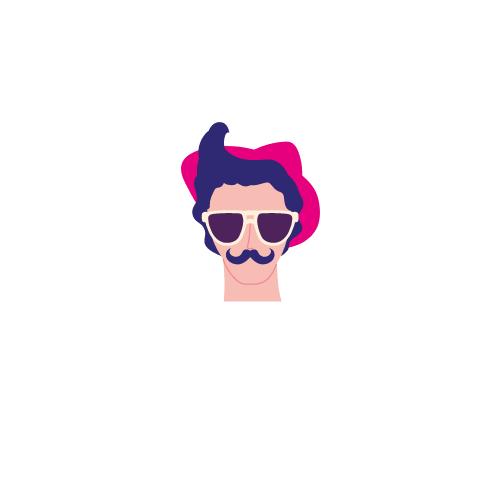

# UncleNomad

  

UncleNomad is a full-stack, production-grade travel and stay booking platform built for the company Uncle Nomad. Designed for high-traffic, real-world use, it enables users to seamlessly book tours, stays, and related travel services. This project was developed as a freelance engagement and is ready for deployment to serve a large user base.

## Features

- **User Authentication**: Secure login and registration via email, phone (OTP), and JWT-based sessions.
- **Tour Booking**: Browse, book, and manage tours with real-time availability checks, itinerary details, and booking receipts.
- **Stay Booking**: Search and book rooms/properties, upload images, and manage bookings.
- **Payment Integration**: Supports Razorpay and Paytm for secure online payments, with payment verification and callback handling.
- **Booking Management**: Export bookings to Excel, generate receipts, and manage bookings (CRUD) for both users and admins.
- **Admin Dashboard**: Manage tours, rooms, properties, bookings, users, and site content.
- **Email & Mobile Verification**: OTP-based verification for secure onboarding and transactions.
- **Blog & Gallery**: Content management for travel blogs, user reviews, and media galleries.
- **Modern UI/UX**: Responsive frontend built with React, Tailwind CSS, and a modern component library for a seamless user experience.

## Tech Stack

### Frontend

- [React](https://reactjs.org/) (Create React App)
- [Tailwind CSS](https://tailwindcss.com/)
- [shadcn/ui](https://ui.shadcn.com/), [Radix UI](https://www.radix-ui.com/), [Heroicons](https://heroicons.com/)
- [Axios](https://axios-http.com/) for API requests

### Backend

- [Node.js](https://nodejs.org/) + [Express](https://expressjs.com/)
- [MongoDB](https://www.mongodb.com/) with [Mongoose](https://mongoosejs.com/)
- [JWT](https://jwt.io/) for authentication
- [Razorpay](https://razorpay.com/) & [Paytm](https://paytm.com/) payment gateways
- [Cloudinary](https://cloudinary.com/) for media uploads
- [Nodemailer](https://nodemailer.com/) for email services

## Visit UncleNomad

UncleNomad is a proprietary, production website for travel and stay bookings. To experience the platform, please visit:

- [https://unclenomad.in](https://unclenomad.in)
- [https://unclenomad.com](https://unclenomad.com)

## Deployment

This project is deployed and maintained by the Uncle Nomad team. It is not intended for public installation or self-hosting.

## Contributing

This project was developed as a freelance engagement and is not open for public contributions.

## License

This project is proprietary and owned by Uncle Nomad.

## Contact

For business inquiries or support, contact [support@unclenomad.com](mailto:support@unclenomad.com).
